## Part 1: Keeping Secrets OUT of Docker Images

### Question 1

When the .env file is copied into the image (using COPY . .), it becomes part of a Docker layer. Even if you delete the .env file in a later layer, Docker images maintain each layer in the image history, which means the sensitive information could still be extracted by anyone with access to the image.

### Question 2

Using the tool [dive](https://github.com/wagoodman/dive) we can observe that the docker image contains the `.env` file within its layers.
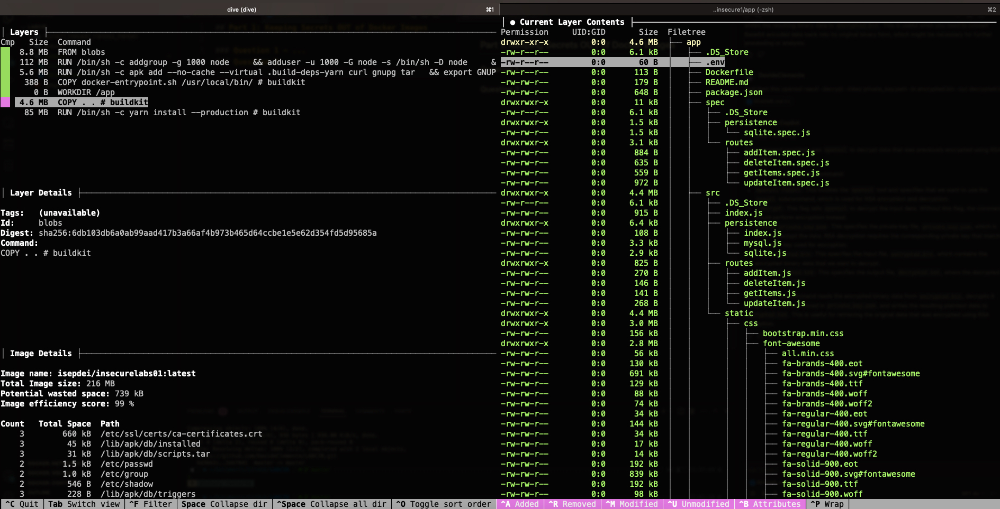

In order to retrieve the contents of the `.env` file, we can create a temporary container from the image and then use the `docker export` command to export its contents to a `.tar` file:

-   `docker create --name insecure1_temp isepdei/insecurelabs01:latest`
-   `docker export insecure1_temp -o insecure1.tar`

After creating the tar file, we can use the `tar` cli tool to decompress the contents into a regular folder.

-   `mkdir insecure1`
-   `tar -xvf insecure1.tar -C insecure1`

Navigating inside the /app folder, we can already see the `.env` file and it's content
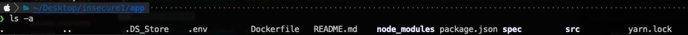
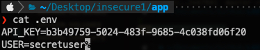

An alternative approach is to pull the image and run it in an interactive shell, which allows us to examine the container's environment and potentially explore or test security settings. To do this, run the following commands:

-   `docker pull isepdei/insecurelabs01:latest`
-   `docker run -it isepdei/insecurelabs01:latest /bin/sh`
-   `cat .env`

Additionally, we can simply copy the contents of the .env file to a new file for further inspection. To do this, locate the container ID of the running container and then copy the file from the container to our local system:

-   `docker ps`
-   `docker cp <container_id>:/app/.env <local_path>/.env `

After executing these commands, we can review the contents of the .env file.

### Question 3

The change to the Dockerfile in which Tom removes the `.env` file after the yarn install step is an attempt to prevent the `.env` file from remaining in the final image.
However, each command in a Dockerfile creates a new layer in the image. When the `.env` file is copied into the image and subsequently removed, it is still present in the previous layers. This means anyone with access to the Docker image can retrieve the `.env` file by inspecting the image’s layer history.

### Question 4

In order to recover the new api key, we made use again of the `dive` tool.
As seen in the following figure, the `.env` file is added to the image in layer with digest `sha256:dbe6f4e6fd9843a235b3c1f548841df0519851502bae1c70636e51e911d977d5`.


We can save the multiple image layers to a `tar` file using the `docker save` command:

-   `docker save -o insecurelabs2.tar  isepdei/insecurelabs02:latest`

After that, we can use the `tar` tool again to extract the contents into a folder:

-   `tar -tvf insecurelabs2.tar`


Analyzing the multiple file inside `/blobs/sha256` we can right away identify layer `dbe6f4e6fd9843a235b3c1f548841df0519851502bae1c70636e51e911d977d5`, corresponding to the information `dive` gave us.

Among other information inside this specific file, we can see the secrets Tom tried to protect:

-   `API_KEY=7b5539b2-f0e2-4302-803f-c95289c7f0d7`
-   `USER=jdsl`

### Question 5

In order to use environment variables in docker, we have a few options:

-   We could specify them with the `-e` flag or with an `.env` file:
    -   `docker run -e API_KEY=xxxx -e USER=tom isepdei/insecurelabs01:latest`
    -   `docker run --env-file .env -p 3000:3000 insecurelabs01:latest`
-   Use docker secrets (If using Docker Swarm or Kubernetes):
-   use external secrets management solutions like AWS Secrets Manager or HashiCorp Vault

### Question 6

In order to remove the `cap_net_raw` capability from the `ping` command, we issued the command:

-   `sudo setcap cap_net_raw-ep /usr/bin/ping`

After this operation, trying to execute a ping command resulted in the following error:

-   `ping: => missing cap_net_raw+p capability or setuid?`
-   

### Question 12

By executing the command `docker exec captest sh -c 'grep Cap /proc/1/status'` we can see the of the inheritable, permitted and effective capabilities of a process running in the container.
This is the output of the command:
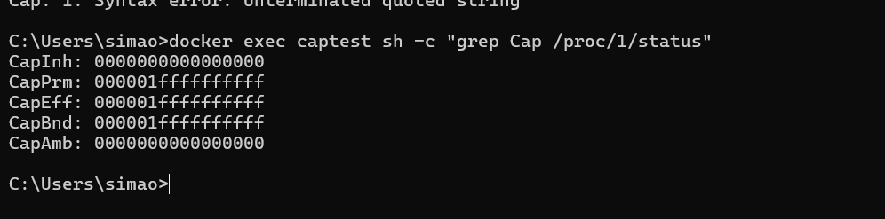

This command outputs the capabilities of the process running in the container with the following format:

```
CapInh: 0000000000000000
CapPrm: 000001ffffffffff
CapEff: 000001ffffffffff
CapBnd: 000001ffffffffff
CapAmb: 0000000000000000
```

The `CapInh` field shows the inheritable capabilities of the process, the `CapPrm` field shows the permitted capabilities of the process and the `CapEff` field shows the effective capabilities of the process.

The `CapBnd` field shows the bounding capabilities of the process, and the `CapAmb` field shows the ambient capabilities of the process.


After that ,to decode the output of each capability field the command `docker exec captest sh -c 'capsh --decode=00000000a80425fb'
` can be used and by doing that we can see that:

- The CapInh shows that the container does not have any inheritable capabilities
- The CaPPrm,CaPPeff,CaPBnd are encoded the same way which means the permitted, effective and bounding capabilities of the container are the following:
  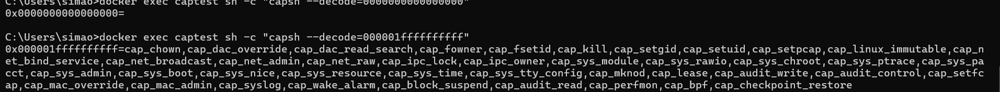
- The CapAmbs shows that the container does not have any ambient capabilities

If we compared this result with the result obtained with the command `docker exec captest sh -c 'capsh --print'` we can see that it provides a more human-readable breakdown of the capabilities representing the same result obtained with the command `docker exec captest sh -c 'grep Cap /proc/1/status'`
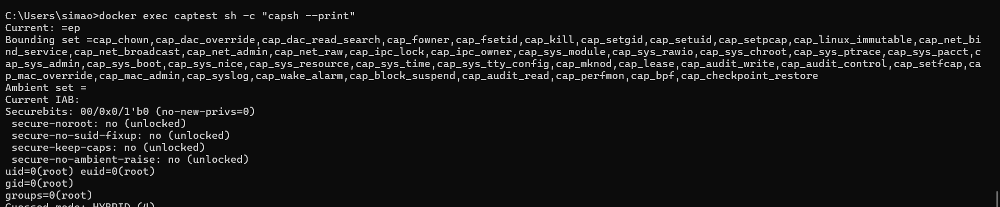

### Question 13

By running the container with the command `docker run --name captest --cap-drop all -d -p 8000:80 isepdei/capabilities01
` we drop all capabilities from the container including the `cap_net_raw` capability used by the ping command.
After that if we try to execute the ping command (e.g `docker exec captest sh -c 'ping www.dei.isep.ipp.pt'`) we get the following error:

- `ping: socket: Operation not permitted`
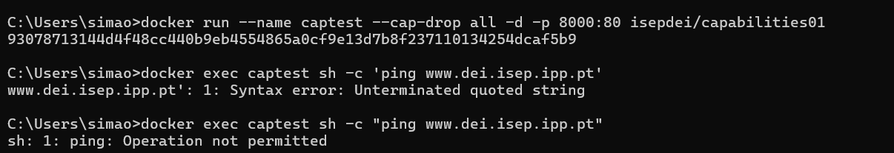


This error indicates that the container does not have the `cap_net_raw` capability, which means that the ping command cannot use the raw socket to send ICMP echo requests.

In order to fix this issue, we can use the `--cap-add` flag to add the `cap_net_raw` capability to the container and still drop all other capabilities.
By running the container with the command `docker run --name captest --cap-add=cap_net_raw --cap-drop all -d -p 8000:80 isepdei/capabilities01
` we add the `cap_net_raw` capability to the container and drop all other capabilities.
After that if we try to execute the ping command (e.g `docker exec captest sh -c 'ping www.dei.isep.ipp.pt'`) we get the following output:

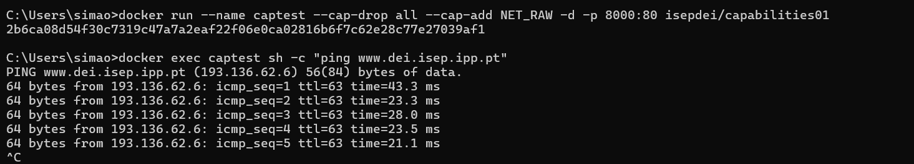

This output indicates that the ping command can now use the raw socket to send ICMP echo requests. Additionally, this approach ensures that we follow the principle of least privilege.

### Question 14

According to the docker documentation, the `--privileged` flag gives all capabilities to the container, and it also lifts all the limitations enforced by the device cgroup controller.
This means that when we run docker with the command `docker run -d --privileged -p 80:80 isepdei/insecurelabs03` the container is given all capabilities. If we output the capabilities with command `>docker exec beeaadbc9d4934745ea1cda47f395a3774d61f96787e57647a572369a0a25ddc sh -c "capsh --print"` with `beeaadbc9d4934745ea1cda47f395a3774d61f96787e57647a572369a0a25ddc` being the container ID, we can see that the container has all capabilities:
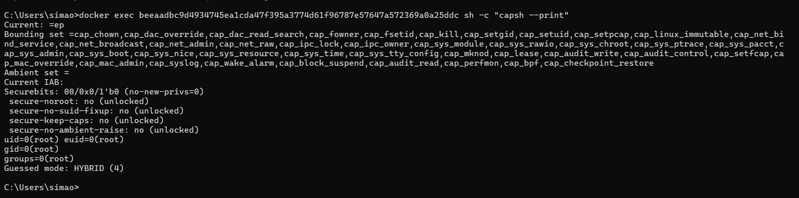

These includes critical capabilities such as:

- `cap_sys_admin`: Allows control over many system-level configurations, effectively granting superuser-like privileges.
- `cap_net_admin` & `cap_net_raw`: Allow manipulating network settings and creating raw sockets.
- `cap_sys_rawio`: Grants access to low-level I/O operations on devices, enabling interaction with the host's hardware directly.
- `cap_sys_ptrace`: Enables debugging and inspecting processes, which could lead to leaking sensitive information from the host.
- `cap_sys_module`: Allows loading/unloading kernel modules, which can alter the kernel behavior of the host.


### Question 15

Since `fdisk` is installed in the container, and since we are running the docker with the `--privileged` flag, we can use the `docker exec` command to execute it inside the container:

-   `docker exec insecurelabs03 fdisk -l`

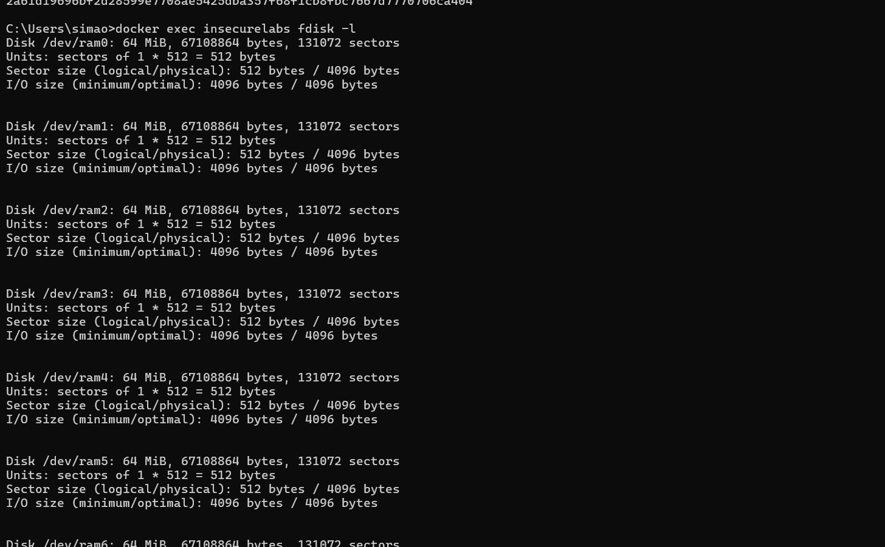

This allows us to see the partitions of the host system, which can be used to gain access to the host's file system.

So from here we can see that there is a partition with the name `/dev/sda`. Then if we execute the docker in interactive mode with the command `docker run -it --privileged -p 80:80 isepdei/insecurelabs03` we can see the `/dev/sda` partition mounted in the container.


We can then use the `fdisk` command to see the partitions of the container's file system:

-   `docker exec insecurelabs03 fdisk -l`


This allows us to see the partitions of the container's file system, which can be used to gain access to the container's file system.

Now if we execute the docker container in interactive mode with the command `docker run -it --privileged -p 80:80 --name labcib isepdei/insecurelabs03 bash`  we can run commands inside the container.

One of this commands is `mkdir -p /mnt/test` which creates a directory in the container's file system.
After that we  can mount the container file system with the command `mount /dev/sda1 /mnt/test` and then we would gain  access to filesystem of the host. 
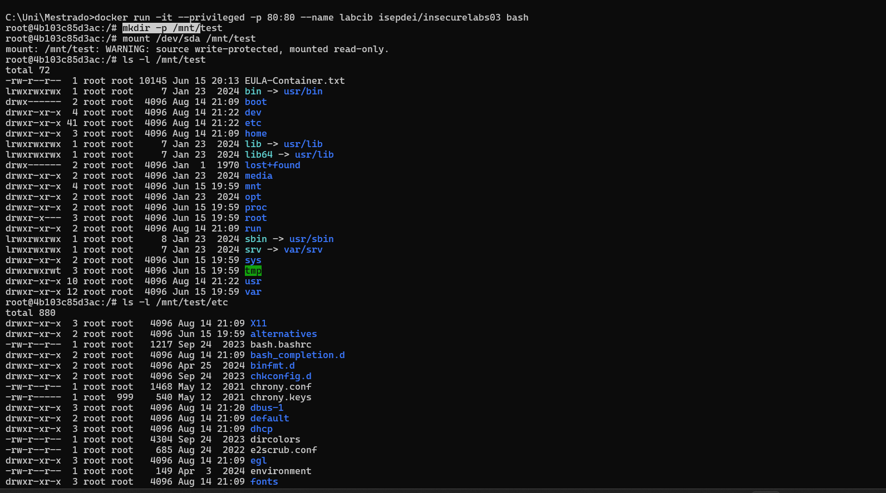
With this we would be able to read the files of the host such as for example `/etc/passwd`, the security configuration files or navigate to the `\var` directory and read the content of the system and application logs.
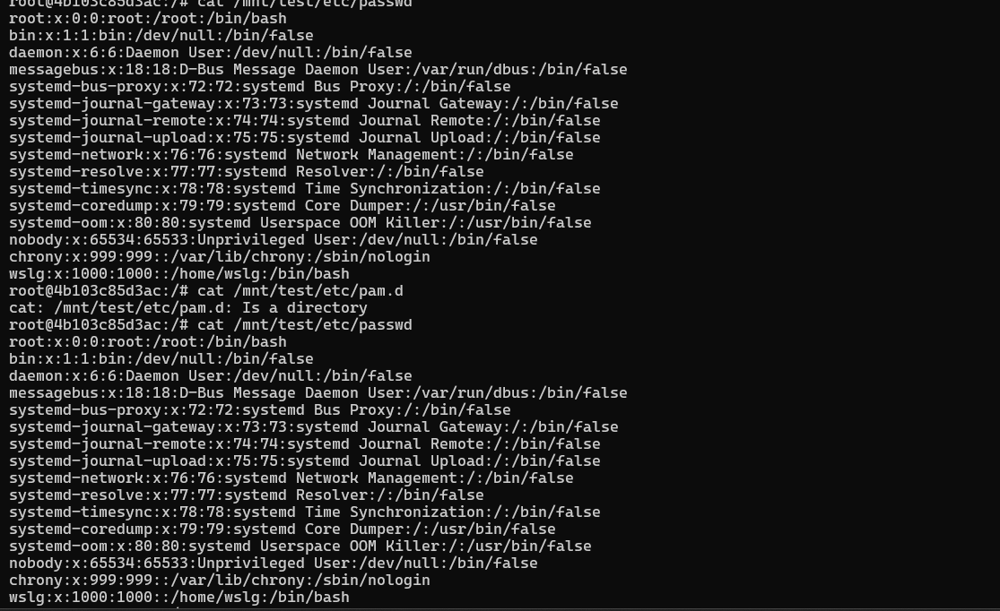


### Question 16


### Question 17

Ensuring the security of Docker containers is crucial to preventing unauthorized access and data breaches. Therefore some of the best practices for securing Docker containers include:

-   Keeping the container image up-to-date with the latest security patches and updates.
-   Regularly scan images for vulnerabilities such as JFrog,Clair or Trivy.
-   Remove unnecessary packages and services from the image. For example, using a scenario of this lab class, services such as `fdisk` are not needed in the container. This will ensure that the container image is minimal and therefore it will reduce the attack surface.
-   Avoid running containers with unnecessary privileges (--privileged flag). Containers should only run with the minimum privileges required to perform their intended function. Therefore, capabilities should be dropped from the container.
-   Use read-only file systems (--read-only flag) to protect container files.
-   Prevent containers from escalating privileges by using the --security-opt flag with the no-new-privileges option. This will ensure that setuid and setgid will have no effect on the container.
-   Avoid exposing the docker socket and when needed ensure that it is only exposed via TLS.
-   Use firewall rules or Docker network modes to restrict communication between containers.
-   Store sensitive data like passwords or API keys in Docker Secrets rather than hardcoding them into images or environment variables.
-   Enable logging for container activity and integrate it with centralized log management tools like Prometheus.
-   Set limits for CPU, memory, and disk usage to prevent containers from consuming excessive resources.